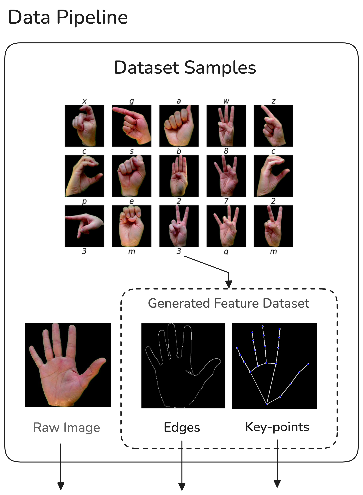
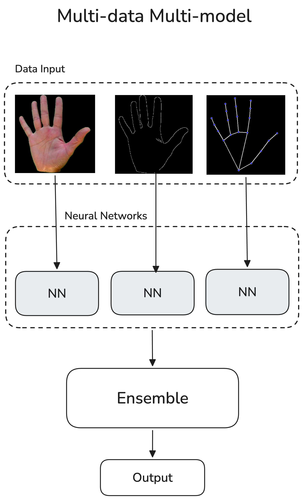
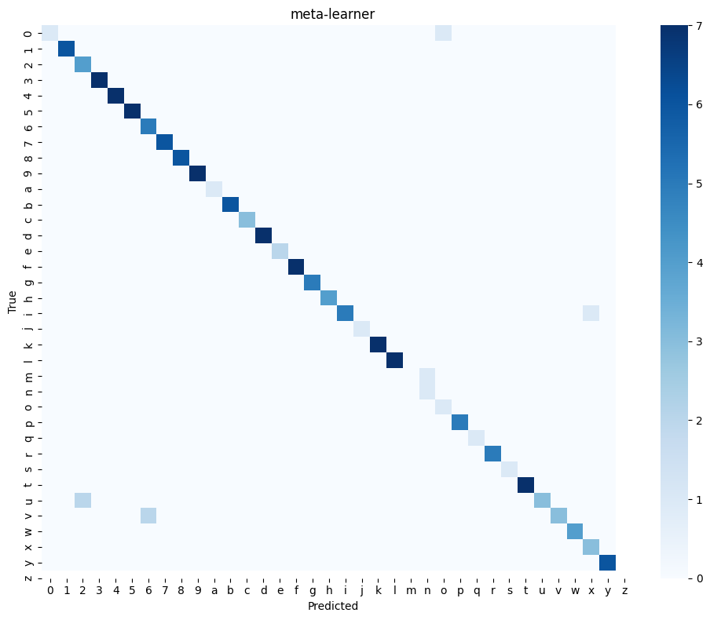

# Multi-data Multi-Model Ensemble

combining multi data presentation and using multi-model ensembel(average, meta-learner) to produce robust result.

**Inspired by human(brain) multi-level of attention.**

## Data pipeline generation

from raw images dataset of Alphabet Sign lanaguge *(_rgb.zip)*, extract edges and skeleton key-points.

unzip dataset file then , generate data

code file : 
`edge_data.py`
`keypoint_data.py`

## Model Architecture

Modeling : `multi-view-modeling.ipynb`

using cross-validation to get rid of data leakage problem, result :  

